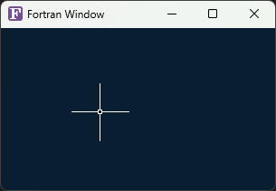

# Minimal WinAPI GUI App in Fortran

This is a minimal graphical Windows application written in modern Fortran using the WinAPI.  
It demonstrates how to create a basic window, handle events, show Unicode titles, and load custom icons.

## Features

- Written in Fortran (F2008 standard)
- Uses raw Windows API bindings
- Unicode window title (UTF-16 via `c_wchar_t`)
- Loads `.ico` icon via `LoadImageW`
- Custom `WndProc` handler
- Background brush and small/large icon handling

## Build

Use `gfortran` with these flags:

```bash
gfortran win.f95 -o win.exe -mwindows -std=f2008 -Wall -Wextra -pedantic
```

Or use the provided `build.bat`.

## Screenshot



## License

This project is released under the MIT License. You are free to use, modify, and distribute it.
